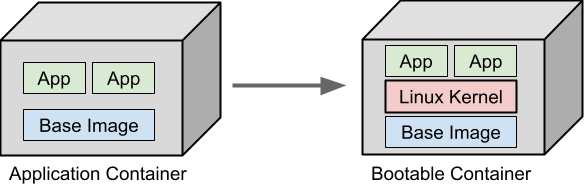
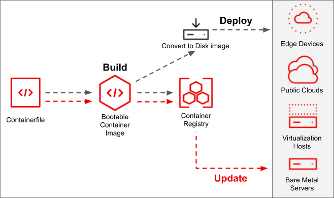

# Bootable Containers: 
## Build Your Own Immutable Distro

###### Michael Fox
###### SouthEast LinuxFest 2025

###### https://github.com/spmfox/presentations

<!-- footer: v1.1 -->

---
## What are bootable containers?
Bootable containers are basically container images that also include the kernel.

They can be built, run, pushed, and pulled just like regular containers, with the added benefit of being deployable directly to a host.

Once deployed, there is no container runtime. This lets you build full system images using container tools.

###### https://docs.fedoraproject.org/en-US/bootc/getting-started/

<!-- footer: "" -->

--- 
## What are bootable containers?

###### https://docs.fedoraproject.org/en-US/bootc/getting-started/

---
## How does it work?
When a bootable container is run, it behaves like a regular container. Once deployed to a host, it stops being a container and becomes an immutable system.

An immutable system keeps user data separate from system data. This allows the system to be updated or rolled back as a whole, while your data remains unchanged.

`bootc` is the tool that enables all of this. After deployment, it uses rpm-ostree to manage the system's immutability.

###### https://bootc-dev.github.io/bootc/man/bootc.html
###### https://coreos.github.io/rpm-ostree/

---
## What is bootc?
### `bootc`
> Transactional, in-place operating system updates using OCI/Docker container images. bootc is the key component in a broader mission of bootable containers.

> The original Docker container model of using "layers" to model applications has been extremely successful. This project aims to apply the same technique for bootable host systems - using standard OCI/Docker containers as a transport and delivery format for base operating system updates.
###### https://bootc-dev.github.io/bootc/

---
## FAQ
- Is my system a container now?
  - No. After the image is deployed on a machine, there is no container runtime involved.

- Can the image be run as a normal container?
  - Yes. But when run this way, it uses the host's kernel (like any regular container) and ignores the kernel inside the image.

###### https://bootc-dev.github.io/bootc/building/bootc-runtime.html

---
## Filesystem Layout
During the container build, all files are writable, just like a normal container. After deployment, only the `/etc` and `/var` directories remain writable.

The `/var` directory is writable and persistent. Its contents do not change with system updates.

###### https://bootc-dev.github.io/bootc/filesystem.html

---
## Filesystem Layout
Once a file is changed or added in `/etc`, it stays persistent indefinitely. Each update or rollback runs a three-way merge to combine changes from the current environment, the default environment, and the new deployment.

This merge can sometimes cause drift. For example, the original image might expect a user defined in `/etc/passwd`, but the running system no longer has it.

###### https://ostreedev.github.io/ostree/atomic-upgrades/#assembling-a-new-deployment-directory
###### https://lwn.net/Articles/1018082/

---
## What are the deployment methods?
- `bootc-install`
    - `bootc-install-to-disk`: Install to the target block device
    - `bootc-install-to-filesystem`: Install to an externally created filesystem structure
    - `bootc-install-to-existing-root`: Install to the host root filesystem
- External Installers
    - Anaconda
    - `bootc-image-builder`
###### https://docs.fedoraproject.org/en-US/bootc/provisioning-generic/
###### https://docs.fedoraproject.org/en-US/bootc/bare-metal/

---
## What are the deployment methods?
`bootc-install` can deploy to a new disk or an existing filesystem. This allows you to take over an existing system by installing directly onto a running machine.

`bootc-image-builder` can be used to create disk images and ISO files.
###### https://bootc-dev.github.io/bootc/man/bootc-install.html
###### https://github.com/osbuild/bootc-image-builder

---
## Building a bootc Container
bootc containers can be built with Podman using regular Containerfiles:

    FROM quay.io/fedora/fedora-bootc:41
    RUN dnf -y install cowsay lolcat

This is a very simple example which will use Fedora 41 as a base, and install the cowsay and lolcat packages.

`sudo podman build -t localhost/bootc-test -f bootc-test.containerfile`
We will be building as root because bootc needs root access to deploy the container to the local host.

---
## Building a bootc Container

---
## Running a bootc Container
Let's see how a bootc container acts like a regular container.

We will try to use `cowsay` on the host, where it's not installed, then we can try in the container with `podman run`.

---
## Running a bootc Container

---
## Deploying a bootc Image On Top of an Existing System
A quick way to deploy a bootc image is on top of a running system.

    podman run --rm --privileged \
        --pid=host --security-opt label=type:unconfined_t \
        --volume /dev:/dev \
        --volume /var/lib/containers:/var/lib/containers \
        --volume /:/target \
        --entrypoint bootc \
        localhost/bootc-test:latest \
        install to-filesystem --skip-fetch-check --replace=alongside /target \
	    --root-ssh-authorized-keys /target/root/.ssh/authorized_keys \
        --target-transport=containers-storage --acknowledge-destructive

Note that `bootc` is being used from *inside* the container that was built. This means that the container we built already has everything needed to deploy bootc.

---
## Deploying a bootc Image On Top of an Existing System

---
## Deploying a bootc Image On Top of an Existing System
Once the installation is complete, simply reboot the host. When it comes back up, it will be running as a bootc immutable system.

Now that the system has rebooted, let's check if `cowsay` works. It should, since we installed it in the image during the build process.

---
## Deploying a bootc Image On Top of an Existing System

---
## Updating a bootc System
Updating is as simple as pulling a new image or building your own. Let's update our test environment to Fedora 42.

    FROM quay.io/fedora/fedora-bootc:42
    RUN dnf -y install cowsay lolcat

`sudo podman build -t localhost/bootc-test -f bootc-test.containerfile`
`sudo bootc update`

---
## Updating a bootc System

---
## Updating a bootc System
Total time needed to update our system from F41 -> F42 was **2 minutes 9 seconds**. Once rebooted, this system will be on Fedora 42.

---
## Temporarily Adding Packages
You can temporarily make `/usr` writable and use `dnf` to install packages. These changes won't persist after a reboot, but they're useful for testing or making quick, temporary modifications.

`bootc usr-overlay`

---
## Temporarily Adding Packages

---
## Rolling Back a bootc System
Rollbacks can be performed in two ways:
- From the GRUB menu during boot
- Directly from the running system

`bootc rollback`

---
## Rolling Back a bootc System

---
## Rolling Back a bootc System
Total time needed for a rollback to Fedora 41 was about **2 seconds** plus a reboot.

---
## Why use bootc over other immutable systems?
- Simplify build process
  - Reuse what you already know about building containers
  - Take advantage of existing container build tools

- Unify processes
  - Build bare metal, VM, and container images using the same method and pipeline
  - Scan OS images using container security tools

---
## What does this look like in production?
Your Containerfiles can be as large or complex as needed. The following example is a Containerfile deployed with Ansible.

It does several things, including:
- Starts from a Fedora base image
- Installs tools like smartmontools, hdparm, and wireguard-tools
- Configures firewalld
- Installs ZFS, including the Cockpit plugin and Sanoid/Syncoid
- Sets up KVM
- Installs NFS and Samba

###### https://github.com/spmfox/BootcBlade/blob/main/templates/bootcblade.containerfile.j2

---
## What does this look like in production?

---
## What does this look like in production?
Updates are handled via a systemd service:

    [Unit]
    After=network-online.target
    Wants=network-online.target
    Description=BootcBlade rebuild service

    [Service]
    Type=oneshot
    TimeoutStartSec=30m
    ExecStart=/usr/bin/bash -c "podman build -t localhost/bootcblade \
      -f /root/bootcblade.containerfile --pull=always"
    ExecStartPost=/usr/bin/bash -c "bootc switch --transport containers-storage \
      localhost/bootcblade:latest && bootc update"
    ExecStartPost=-sleep 10 ; podman image prune -f

###### https://github.com/spmfox/BootcBlade/blob/main/templates/bootcblade-rebuild.service.j2

---
## What does this look like in production?
And scheduled via a systemd timer:

    [Unit]
    Description=bootcblade-rebuild timer

    [Timer]
    OnCalendar=weekly
    Persistent=true

    [Install]
    WantedBy=timers.target

###### https://github.com/spmfox/BootcBlade/blob/main/templates/bootcblade-rebuild.timer.j2

---
## What does this look like in production?
With bootc, installing ZFS kernel modules via DKMS is now risk-free. There's no chance of a broken system due to failed module builds.

If the build succeeds, it's staged for the next reboot. If it fails, nothing changes and the current system keeps running safely.

---
## How can this be automated?
### BootcBlade - https://github.com/spmfox/BootcBlade
> Ansible automation for deploying a KVM hypervisor using bootc on Fedora Server.
- Use Jinja templating for the Containerfile, `bootc install` command, and custom systemd services for updating
- Handle host configuration, like adding SSH keys before deployment
- Automate post-deploy tasks, such as creating users and setting up systemd jobs

---
## How can this be automated?

---
## Links and Q&A
bootc
- https://docs.fedoraproject.org/en-US/bootc/getting-started/
- https://bootc-dev.github.io/bootc/
- https://github.com/bootc-dev/bootc
- https://github.com/osbuild/bootc-image-builder

Presentation
- https://github.com/marp-team/marp-cli
- https://github.com/charmbracelet/vhs

###### https://github.com/spmfox/BootcBlade

---
# Thank you
### Bootable Containers: 
#### Build Your Own Immutable Distro

###### Michael Fox
###### https://github.com/spmfox/presentations

<!--

-->
