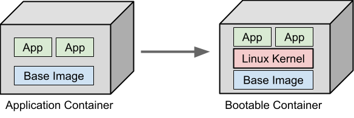
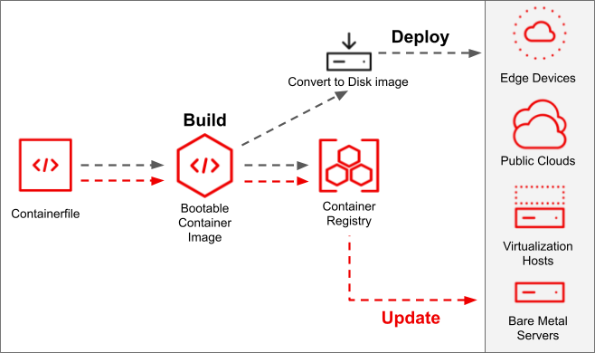

# Bootable Containers: 
## Build your own immutable distro

###### Michael Fox
###### SouthEast LinuxFest 2025

---
## What are bootable containers?
- OS image + kernel, built with container tools
- Build, push, and pull like normal containers
- Once deployed there is no container runtime

---
## What are bootable containers?

###### https://docs.fedoraproject.org/en-US/bootc/getting-started/

--- 
## What are bootable containers?

###### https://docs.fedoraproject.org/en-US/bootc/getting-started/

---
## How does it work?
### `bootc`
> Transactional, in-place operating system updates using OCI/Docker container images. bootc is the key component in a broader mission of bootable containers.

> The original Docker container model of using "layers" to model applications has been extremely successful. This project aims to apply the same technique for bootable host systems - using standard OCI/Docker containers as a transport and delivery format for base operating system updates.

###### https://bootc-dev.github.io/bootc/

---
## How does it work?
bootc currently uses rpm-ostree as the backend.

Some of the main commands:
- `bootc install`
- `bootc update`
- `bootc rollback`
- `bootc usr-overlay`

###### https://bootc-dev.github.io/bootc/man/bootc.html

---
## FAQ
- Is my system a container now?
    - No, once the image is deployed on a machine there is no container runtime
- Can the image be run as a "normal" container?
    - Yes, included kernel is ignored and host kernel is used (as you'd expect)
###### https://bootc-dev.github.io/bootc/building/bootc-runtime.html

---
## FAQ
-  During container build, all files are writable (as you'd expect)
-  Once deployed, everything is read-only except `/var` and `/etc`
-  `/var` is completely persistant, `/etc` is partially persistant
    - Once a file is modified or added to `/etc`, this file will stay persistant forever
    - This can cause "drift" where the built image expects something in `/etc`, perhaps a user, but the booted system does not have it defined

###### https://bootc-dev.github.io/bootc/filesystem.html

---
## What are the deployment methods?
- `bootc-install`
    - `bootc-install-to-disk`: Install to the target block device
    - `bootc-install-to-filesystem`: Install to an externally created filesystem structure
    - `bootc-install-to-existing-root`: Install to the host root filesystem
- External Installers
    - Anaconda
    - `bootc-image-builder`
###### https://docs.fedoraproject.org/en-US/bootc/provisioning-generic/
###### https://docs.fedoraproject.org/en-US/bootc/bare-metal/

---
## What are the deployment methods?
`bootc-install` has the ability to deploy to a new disk or to an existing filesystem. This can be used to "take over" an existing system by deploying right on top of a running system. This can be handy for quick testing.

`bootc-image-builder` can be used to create disk images and ISO files.
###### https://bootc-dev.github.io/bootc/man/bootc-install.html
###### https://github.com/osbuild/bootc-image-builder

---
## Building a bootc container
bootc containers can be built with Podman using regular containerfiles:

    FROM quay.io/fedora/fedora-bootc:41
    RUN dnf -y install fish fastfetch

This is a very simple example which will use Fedora 41 as a base and install the fish and fastfetch packages.

---
## Building a bootc container

---
## Running a bootc container (as a container)
In the next example, fastfetch is shown to be not installed on the host system. After jumping into the bootc-test container fastfetch is available.

This simple example shows the bootc container usage workflow is no different than the standard container workflow.

---
## Running a bootc container (as a container)

---
## Deploying a bootc image (on top of an existing system)
One of the fastest way of deploying a bootc image is installing on top of an existing system.

    podman run --rm --privileged \
        --pid=host --security-opt label=type:unconfined_t \
        --volume /dev:/dev \
        --volume /var/lib/containers:/var/lib/containers \
        --volume /:/target \
        --entrypoint bootc \
        localhost/bootc-test:latest \
        install to-filesystem --skip-fetch-check --replace=alongside /target \
	    --root-ssh-authorized-keys /target/root/.ssh/authorized_keys \
        --target-transport=containers-storage --acknowledge-destructive

Note that `bootc` is being used from *inside* the container that was built. This means that the container image itself has everything needed to deploy bootc.

---
## Deploying a bootc image (on top of an existing system)

---
## Updating a bootc system
Updating is as simple as pulling a new image, or building your own. Lets update our test environment to Fedora 42, remove fish & fastfetch, and add cowsay.

    FROM quay.io/fedora/fedora-bootc:42
    RUN dnf -y install cowsay

`bootc update`

---
## Updating a bootc system

---
## Updating a bootc system
Total time needed to update our system from F41 -> F42 was **2 minutes 18 seconds**. Once rebooted, this system will be on Fedora 42.

---
## Rolling back a bootc system
Rollbacks can be done via grub (during boot) or from the running system. 

`bootc rollback`

---
## Rolling back a bootc system

---
## Rolling back a bootc system
Total time needed for a rollback to Fedora 41 was about **2 seconds** plus a reboot.

---
## Temporarily adding packages
You can temporarily make `/usr` writable and use `dnf` to install packages. These changes will be lost after a reboot, but it makes testing or ephemeral changes easy.

`bootc usr-overlay`

---
## Temporarily adding packages

---
## What does this look like in production?

---
## What does this look like in production?
Your containerfiles can be as large or as complex as necessary. The file we just saw is a containerfile that is deployed with Ansible.
Among other things, this containerfile:
- Starts with Fedora
- Installs various tools packages (smartmontools, hdparm, wireguard-tools, etc)
- Configures firewalld
- Installs ZFS, including Cockpit addon as well as Sanoid/Syncoid
- Installs KVM
- Installs NFS and Samba

###### https://github.com/spmfox/BootcBlade/blob/main/templates/bootcblade.containerfile.j2

---
## What does this look like in production?
Updates are handled via a systemd service:

    [Unit]
    After=network-online.target
    Wants=network-online.target
    Description=BootcBlade rebuild service

    [Service]
    Type=oneshot
    TimeoutStartSec=30m
    ExecStart=/usr/bin/bash -c "podman build -t localhost/bootcblade -f /root/bootcblade.containerfile --pull=always"
    ExecStartPost=/usr/bin/bash -c "bootc switch --transport containers-storage localhost/bootcblade:latest && bootc update"
    ExecStartPost=-sleep 10 ; podman image prune -f

###### https://github.com/spmfox/BootcBlade/blob/main/templates/bootcblade-rebuild.service.j2

---
## What does this look like in production?
And scheduled via a systemd timer:

    [Unit]
    Description=bootcblade-rebuild timer

    [Timer]
    OnCalendar=weekly
    Persistent=true

    [Install]
    WantedBy=timers.target

###### https://github.com/spmfox/BootcBlade/blob/main/templates/bootcblade-rebuild.timer.j2

---
## What does this look like in production?
Using bootc, installing ZFS kernel modules via DKMS is now a risk free process. There is no chance the modules will fail to build and ZFS will be broken on a reboot.

Either the build is successful, and it is staged for the next reboot, or it fails and nothing happens.

---
## How can this be automated?
Ansible can be used to automate each step of this process:
- Jinja templating for the containerfile, `bootc install` command, and custom systemd services for updating
- Host configuration such as adding the proper ssh keys before deploy and creating the user and systemd jobs after deploy

###### https://github.com/spmfox/BootcBlade

---
## How can this be automated?

---
## Why use bootc over other immutable systems?

- Simplify build process
  - Use existing container build knowledge
  - Leverage container build tools

- Unify processes
  - Your metal, VM, and container images can be built with one method and one pipeline
  - Use container vulnerability tools to scan OS images

---
## Links and Q&A
bootc
- https://docs.fedoraproject.org/en-US/bootc/getting-started/
- https://bootc-dev.github.io/bootc/
- https://github.com/bootc-dev/bootc
- https://github.com/osbuild/bootc-image-builder

Presentation
- https://github.com/marp-team/marp-cli
- https://github.com/charmbracelet/vhs

###### https://github.com/spmfox/BootcBlade

---
# Thank you
### Bootable Containers: 
#### Build your own Immutable Distro

###### Michael Fox
###### https://github.com/spmfox
