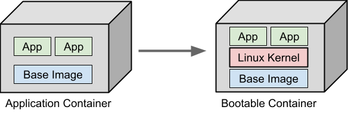
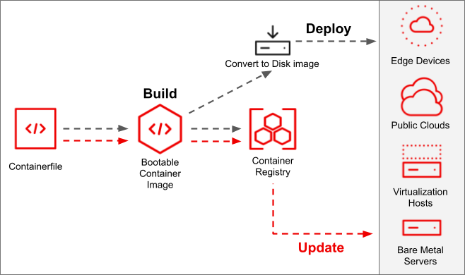

# Bootable Containers: 
## Build Your Own Immutable Distro

###### Michael Fox
###### SouthEast LinuxFest 2026

###### https://github.com/spmfox/presentations
###### https://gitlab.com/spmfox/presentations

<!-- footer: v1.3 -->

---
## Follow Along:

<!-- footer: "" -->

---
## What are bootable containers?
Bootable containers are container images that also include a kernel.

Using the `bootc` tool, these containers can be deployed to a host in the form of an immutable operating system.

These bootable containers can also be built, pushed, pulled, and run just like normal containers.

###### https://docs.fedoraproject.org/en-US/bootc/getting-started/

--- 
## What are bootable containers?

###### https://docs.fedoraproject.org/en-US/bootc/getting-started/

---
## Why use bootable containers over other immutable systems?
- Simplify OS build steps
  - Reuse what you already know about building containers
  - Take advantage of existing container build tools

- Unify processes
  - Build bare metal, VM, and container images using the same method and pipelines
  - Scan OS images using container security tools

---
## What is `bootc`?
`bootc` is a tool for deploying and updating operating systems using container images.

Instead of using containers only for applications, `bootc` extends the Docker/OCI model to whole operating systems. It delivers OS updates as standard container images, and applies them in place on a running system in a transactional way.

###### https://bootc-dev.github.io/bootc/
###### https://bootc.dev/bootc/man/bootc.8.html

---
## How does it work?
When a bootable container is run, it behaves like a regular container. Once deployed to a host, it stops being a container and becomes an immutable system. **There is no container runtime after deployment to the host.**

An immutable system keeps user data separate from system data. This allows the system to be updated or rolled back as a whole, while user data remains unchanged.

After deployment, `bootc` uses `rpm-ostree` to manage the system's immutability.

###### https://bootc-dev.github.io/bootc/building/bootc-runtime.html
###### https://coreos.github.io/rpm-ostree/

---
## Filesystem Layout
During the container build, all files are writable, just like a normal container. After deployment, only the `/etc` and `/var` directories remain writable.

The `/var` directory is always writable and persistent, and the contents do not change with system updates.

Once a file is changed or added in `/etc`, it stays persistent indefinitely. Otherwise, files in `/etc` will follow what is in the new system update.

###### https://bootc-dev.github.io/bootc/filesystem.html
###### https://ostreedev.github.io/ostree/atomic-upgrades/#assembling-a-new-deployment-directory
###### https://lwn.net/Articles/1018082/

---
## What are the deployment methods?
- Internal installers
    - `bootc-install-to-disk`: Install to the target block device
    - `bootc-install-to-filesystem`: Install to an externally created filesystem structure
    - `bootc-install-to-existing-root`: Install to the host root filesystem
- External installers
    - `bootc-image-builder`: Create disk images and ISO files
    - Anaconda

###### https://bootc.dev/bootc/bootc-install.html
###### https://github.com/osbuild/bootc-image-builder

---
## What are the deployment methods?
As we saw on the last slide, there are many different commands to run the install. The `bootc install` commands can be quite lengthy and hard to remember. Thankfully, there is also a user-friendly tool: `system-reinstall-bootc`.

This tool is a wrapper for `bootc install to-existing root`. It will guide the user through selecting the container image and SSH keys.

Once the installation is completed, the current system will be taken over and rebooted.

https://bootc.dev/bootc/bootc-install.html#using-system-reinstall-bootc

---
## Building a Bootable Container
Bootable containers can be built with Podman using regular Containerfiles:

    FROM quay.io/fedora/fedora-bootc:43
    RUN dnf -y install cbonsai

This is a simple Containerfile using Fedora 43 as a base and installing `cbonsai`.

`sudo podman build -t localhost/bootc-simple -f bootc-simple.containerfile`

This Podman command will build the Containerfile as the root user, which will be needed if `bootc` will deploy this image later.

---
## Building a Bootable Container

---
## Building a Bootable Container
Let's try an advanced multi-stage build:

    FROM docker.io/library/ubuntu AS build
    RUN apt-get update && apt-get install cbonsai

    FROM quay.io/fedora/fedora-bootc:43
    COPY --from=build /usr/games/cbonsai /usr/local/bin/cbonsai

This time `cbonsai` will be installed from Ubuntu, then copied into the `bootc` container during the final stage.

`sudo podman build -t localhost/bootc-multistage -f bootc-multistage.containerfile`

---
## Building a Bootable Container

---
## Running a Bootable Container
A bootable container can be run just like a normal container. In the last example, `cbonsai` was installed from Ubuntu and then transferred into the `bootc` image with a multi-stage build.

The Fedora version of `cbonsai` does not support changing colors, but the Ubuntu one does. Let's run `cbonsai` with color-changing support:

`sudo podman run --rm -it localhost/bootc-multistage cbonsai -l -p -b 0 -k 1,0,1,0 -L 20 -s 50`

---
## Running a Bootable Container

---
## Building in Production
Now for a production example, here is a `bootc` Containerfile with ZFS support:

    FROM quay.io/fedora/fedora-bootc:43
    RUN dnf -y install https://zfsonlinux.org/fedora/zfs-release-3-0$(rpm --eval "%{dist}").noarch.rpm && \
        dnf -y install kernel-devel-$(ls /usr/lib/modules) && \
        dnf -y install zfs && \
        dkms build zfs/$(rpm -q --qf '%{VERSION}' zfs) -k $(ls /usr/lib/modules) && \
        dkms install zfs/$(rpm -q --qf '%{VERSION}' zfs) -k $(ls /usr/lib/modules) && \
        systemctl disable dkms.service

`sudo podman build -t localhost/bootc-zfs -f bootc-zfs.containerfile`

This build took about 5 minutes in a VM with 2 Ryzen 7 5700U cores, 2GB RAM, and a cheap NVMe.

---
## Deploying a Bootable Container
One of the most interesting features of `bootc` is the ability to deploy an image *on top* of an existing host.

Let's use the `system-reinstall-bootc` tool and our `bootc-zfs` image that was just built:

`sudo system-reinstall-bootc localhost/bootc-zfs`

---
## Deploying a Bootable Container

---
## First Boot of Immutable System
After the deployment and reboot, the system is now immutable and based on the `bootc-zfs` image.

Let's check the status of `bootc` and see if `zfs` works.

You might notice that the system is booted into `bootc-zfs-vhs`, this is an image based on `bootc-zfs` that has the `vhs` tool - which is needed to capture the output for this presentation.

---
## First Boot of Immutable System

---
## Temporarily Adding Packages
You can make `/usr` writable by running `bootc usr-overlay`. These changes won't persist after a reboot, but they're useful for testing or making temporary modifications.

Once the `/usr` overlay is applied, `dnf` can be used to add packages to the system.

We are going to use this to install `vim` because it's missing from the standard Fedora install.

---
## Temporarily Adding Packages

---
## Switching Images
Let's add the packages `vhs` and `vim` by creating an image based on `bootc-zfs`:

    FROM localhost/bootc-zfs
    RUN dnf -y install vim vhs

Then we can update our system to this new image, which will be effective after a reboot.

`sudo podman build -t localhost/bootc-zfs-tools -f bootc-zfs-tools.containerfile`

`sudo bootc switch --transport containers-storage localhost/bootc-zfs-tools`

---
## Switching Images

---
## Rolling Back a `bootc` System
Rollbacks can be performed in two ways:
- From the GRUB menu during boot
- Command line from the running system

`bootc rollback`

---
## Overview and Next Steps
We built a Fedora 43 immutable operating system with ZFS baked into the image.

If the ZFS build fails, the image will not be created and the system will not update or switch into a broken state.

Local builds can be automated via a systemd service. The image can be built automatically and deployed in the background. The system would be updated on the next reboot.

---
## More Examples
- BootcBlade
  - My project, runs my servers at home
  - Fedora + ZFS & KVM & NFS & Samba & Cockpit & Sanoid+Syncoid
  - https://github.com/spmfox/BootcBlade
  - https://github.com/spmfox/BootcBlade/blob/main/docs/bootcblade.containerfile
- Bazzite
  - Based on Fedora, focuses on gaming and everyday use
  - https://github.com/ublue-os/bazzite
- Red Hat Image Mode
  - https://developers.redhat.com/products/rhel/image-mode

---
## Links and Q&A
bootc
- https://docs.fedoraproject.org/en-US/bootc/getting-started/
- https://bootc-dev.github.io/bootc/
- https://github.com/bootc-dev/bootc
- https://github.com/osbuild/bootc-image-builder

Presentation
- https://github.com/marp-team/marp-cli
- https://github.com/charmbracelet/vhs

---
# Thank you!
### Bootable Containers: Build Your Own Immutable Distro

###### Michael Fox
###### https://github.com/spmfox/presentations
###### https://gitlab.com/spmfox/presentations

[To render HTML version, uncomment the following script and run marp with --html]::

<!--

-->
