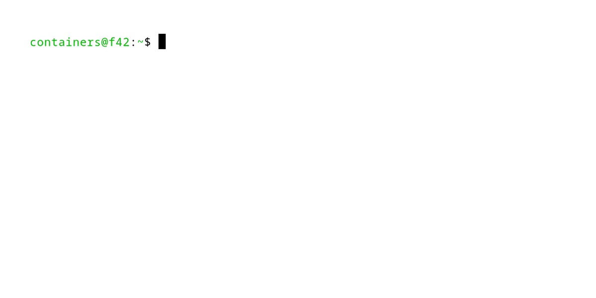

# Podman + Quadlet + Ansible:
## Rootless Service Management

###### Michael Fox
###### SouthEast LinuxFest 2025

###### https://github.com/spmfox/presentations
###### https://presentations.foxwd.com

<!-- footer: v1.2 -->

---
## What are containers?
Containers package applications together with everything they need to run, including their full runtime environment and required files.

This allows the application to work consistently when moved between different environments (development, testing, production, etc.), without losing any functionality.

###### https://www.redhat.com/en/topics/containers

<!-- footer: "" -->

---
## What is Podman?
Podman is an open-source tool used to create, manage, and run containers.

Unlike other container engines, Podman is daemonless, meaning it does not require a background process with root privileges to operate containers.

###### https://www.redhat.com/en/topics/containers/what-is-podman

---
## What are pods?
Pods are collections of containers that run together and share common resources.

Each pod includes one infrastructure (infra) container plus any number of regular containers. The infra container keeps the pod active and manages user namespaces, which separate the containers from the host system.

###### https://www.redhat.com/en/topics/containers/what-is-podman

---
## What is systemd?
systemd is a core part of a Linux system. It manages services and starts everything when the system boots, running as PID 1.

It also includes tools for logging, setting system details like hostname and date, keeping track of users and running containers or virtual machines, and handling basic network setup, time syncing, log forwarding, and name resolution - along with many other essential system management tasks.

###### https://systemd.io/

---
## What is Quadlet?
Quadlet simplifies systemd integration.

It reduces a full systemd service file to the essentials:
  - Dependencies on other services or containers
  - Podman configuration

###### https://www.redhat.com/en/blog/quadlet-podman
###### https://docs.podman.io/en/stable/markdown/podman-systemd.unit.5.html

---
## What is Ansible?
Ansible is an open-source, command-line automation tool written in Python. It can configure systems, deploy software, and automate complex workflows for tasks like application deployment and system updates.

Ansible's main advantages are its simplicity and ease of use. It emphasizes security and reliability with few components, uses OpenSSH by default for communication, and employs a human-readable language that makes it easy to learn and start using quickly.

###### https://www.redhat.com/en/ansible-collaborative/how-ansible-works

---
## How can these tools work together?
1. Pods and containers are defined using Quadlet.
2. Quadlets can be organized into logical groups through Ansible inventory.
3. Ansible can configure the host system.
4. Ansible deploys the Quadlet files using the inventory.
5. systemd detects the Quadlet files and manages the pods and containers as services.

All of this can be done without requiring root privileges (rootless).

---
## How are we using rootless?
For our examples, we will use a dedicated user named `containers` with minimal permissions. This user will have no password, no SSH keys, and no sudo access.

We will switch to this user when running the containers.

###### https://github.com/containers/podman/blob/main/rootless.md

---
## Configuring the Host
What is the bare minimum configuration needed on the host?
- systemd:
  - `loginctl enable-linger <rootless_containers_user>` 
  - If linger is not enabled, systemd will stop a user's processes when not logged in.

- sysctl:
  - `net.ipv4.ip_unprivileged_port_start=<rootless_port_start>`
  - If ports are needed, such as 80 or 22, sysctl needs to know that unprivileged users can use these ports.

###### https://github.com/containers/podman/blob/main/rootless.md

---
## Configuring the Host

---
## Switching Users
We will access the `containers` user using the systemd command `machinectl`. This command has many functions, but we will use it specifically to open a session that can manage systemd user services.

`sudo machinectl shell containers@`

---
## Switching Users

---
## Running Containers with Podman
There are multiple methods of running containers:
- `run`
- `compose`

We will focus on using `podman run` (or `docker run`). If you understand run commands, you can easily work with Quadlet.

Many projects provide Docker Compose files, and there are tools available to convert these compose files into Quadlet files. However, your mileage may vary depending on how complex the compose file is.

---
## Running Your First Rootless Container

---
## Getting Started with Quadlet
Quadlet files are similar to systemd service files, but include additional Podman-specific directives.

Each Quadlet becomes a systemd service once the files are parsed by systemd. 

###### https://docs.podman.io/en/stable/markdown/podman-systemd.unit.5.html

---
## Getting Started with Quadlet
### Syntax
Each Quadlet file has parts of this basic syntax:
- [Unit]: Defines systemd service dependencies
- [Pod]: Pod configuration
  - Pod name, port settings, etc.
- [Container]: Container configuration
  - Container name, environment variables, image, etc.
- [Install]: Instructs systemd to start this Quadlet on boot

Next, we will see an example of a WordPress environment using Quadlet files.

---
## Getting Started with Quadlet
`wordpress.pod`

    [Unit]
    Wants=check-network-online.service podman-auto-update.timer
    Wants=wordpress-app.service wordpress-db.service
    Before=wordpress-app.service wordpress-db.service
    After=check-network-online.service

    [Pod]
    PublishPort=80:80
    PodName=wordpress

    [Install]
    WantedBy=default.target

---
## Getting Started with Quadlet
`wordpress-app.container`

    [Unit]
    Wants=wordpress-pod.service wordpress-db.service
    After=wordpress-pod.service wordpress-db.service
    PartOf=wordpress-pod.service

    [Container]
    ContainerName=wordpress-app
    Pod=wordpress.pod
    Environment=WORDPRESS_DB_HOST=127.0.0.1
    Environment=WORDPRESS_DB_USER=root WORDPRESS_DB_PASSWORD=wordpress
    Environment=WORDPRESS_DB_NAME=wordpress WORDPRESS_TABLE_PREFIX=wp_
    Image=docker.io/library/wordpress:latest
    AutoUpdate=registry

---
## Getting Started with Quadlet
`wordpress-db.container`

    [Unit]
    Wants=wordpress-pod.service
    After=wordpress-pod.service
    PartOf=wordpress-pod.service

    [Container]
    ContainerName=wordpress-db
    Pod=wordpress.pod
    Environment=MARIADB_DATABASE=wordpress
    Environment=MARIADB_ROOT_PASSWORD=wordpress
    Image=docker.io/library/mariadb:latest
    AutoUpdate=registry

---
## Getting Started with Quadlet
### Files
Quadlet files can go in two locations:
- rootless: `$HOME/.config/containers/systemd/`
- root: `/etc/containers/systemd/`

This presentation focuses on rootless. Most systemd commands have the `--user` argument. You can remove `--user` if you want to work at the root level.

Once the files are in place, issue a `systemctl --user daemon-reload` to have systemd reload and automatically deploy the Quadlet files.

---
## Getting Started with Quadlet
### Troubleshooting
`/usr/lib/systemd/system-generators/podman-system-generator --user --dryrun`

This systemd command checks the Quadlet files for syntax. If successful, it will output the converted systemd service files. If it fails, an error message will be shown.

---
## Getting Started with Quadlet
### Running
Once systemd parses the Quadlet files, it creates the corresponding services automatically. The last step is to run `systemctl --user start wordpress-pod.service`.

Quadlet generated systemd services are transient, so they cannot be enabled with `systemctl --user enable`. As long as the `[Install]` section is defined in the Quadlet file, systemd will automatically start the service.

If the Quadlet files are removed and the systemd daemon is reloaded, the services will be removed also (unless they are currently running).

---
## Quadlet in action

---
## How can this be automated?
### PodPlaybook - https://github.com/spmfox/PodPlaybook
>  Ansible playbook for deploying and managing Podman containers.
- Host configuration
  - Creating users and enabling use of privileged ports
  - Setting hostname, timezone, firewall rules, filesystem mounts, and more
- Quadlet configuration
  - Managing many Quadlet files by placing them in the correct directory or removing them
  - Starting or stopping the related systemd services according to the inventory

---
## Automating the Container Deployment
Below is an inventory file for a WordPress pod and containers:
`wordpress.yml`

    all:
      vars:
        wordpress_quadlet_path: '/home/containers/quadlet'
        containers_quadlets:
          - name: 'wordpress-pod'
            path: '{{ wordpress_quadlet_path }}'
            file: 'wordpress.pod'

          - name: 'wordpress-app'
            path: '{{ wordpress_quadlet_path }}'
            file: 'wordpress-app.container'

          - name: 'wordpress-db'
            path: '{{ wordpress_quadlet_path }}'
            file: 'wordpress-db.container'

---
## Automating the Container Deployment

---
## Automating the Entire Stack
Since Ansible supports `machinectl` as a privilege escalation method, you can automate all the manual steps we covered today.

So, what would this look like in a production environment? Let's move this setup to the cloud:
- One cloud VM
- One block storage volume attached to the VM
- The block storage mounted at `/home/containers`
- `/home/containers` will hold all Quadlet and container data
- A WordPress pod containing:
  - The WordPress application container
  - The WordPress database container

---
## Full-stack Inventory

---
## Full-stack Host Configuration

---
## Full-stack Container Configuration

---
## Full-stack Configuration
In under five minutes, the host was configured and the containers were started. The exact time depends on image download speeds and whether any builds are needed.

This approach scales easily: large, complex environments can be defined in an Ansible inventory and managed with simple automation.

---
## Links and Q&A
- https://www.redhat.com/en/blog/quadlet-podman
- https://docs.ansible.com/ansible/latest/getting_started/index.html
- https://docs.podman.io/en/stable/markdown/podman-systemd.unit.5.html
- https://github.com/containers/podman/blob/main/rootless.md

Presentation
- https://github.com/marp-team/marp-cli
- https://github.com/charmbracelet/vhs

###### https://github.com/spmfox/PodPlaybook

---
# Thank you
### Podman + Quadlet + Ansible:
#### Rootless Service Management

###### Michael Fox
###### https://github.com/spmfox/presentations
###### https://presentations.foxwd.com

<!--

-->
